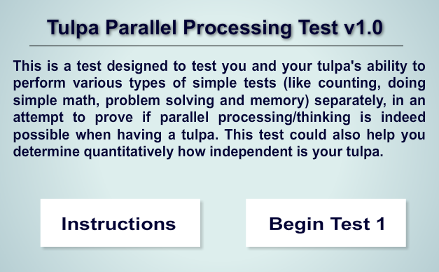
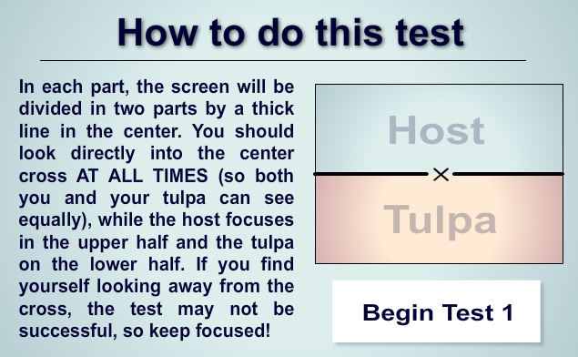
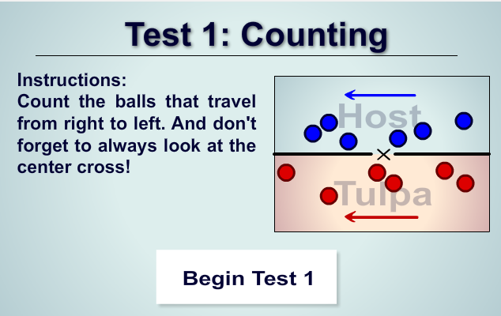

# Parallel-Processing-Test

## 这是什么？

这是个为了方便使用而尝试移植一个flash程序的网页，所以下面也直接贴上原内容，和我的渣翻译。

## 主界面

Tulpa 并行处理测试（练习） v1.0

---

这是一个，设计用来测试你和你的Tulpa，对于几种简单的能力（如计数，简单数学，解决问题和记忆）分别独立解决的能力的测试，尝试证明当有Tulpa时，并行处理（思考）是确实可能的事情。

这个测试还可以帮助你判断你的Tulpa的独立性。

## 总介绍

如何使用这个测试

---

在每个部分，屏幕都会被中间的细长直线分为两部分。
你需要全程把视线集中在屏幕中央的（X）（这样你和你的Tulpa才能平等的看到一样多的区域），host观察上面一半区域，Tulpa观察下面一半区域。
如果你发现你视线看着那个（X）看偏了，测试可能会不太顺利，所以认真点啦。

## 测试一：计数（数球）

介绍：  
数屏幕上从右往左移动的小球，并且别忘了要看着中间的（X）喵！

[测试一的链接](https://soul-charge.github.io/Parallel-Processing-Test/)

